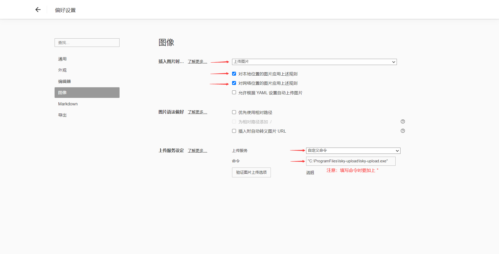

# lsky-upload 文档

> lsky-upload 的相关文档

## 配置文件

程序首次运行会生成 `config.yml` 文件

默认生成的 `config.yml` 文件如下

```yaml
# Lsky 服务器地址
# 例如：https://example.com
lsky-server: https://example.com

# Lsky 接口的 Token
# 例如：1|2kDE7QCXRhIWfgXC9bF3axSbCr1dBjIfRPebQ2oo
lsky-auth-token: 1|2kDE7QCXRhIWfgXC9bF3axSbCr1dBjIfRPebQ2oo

# 是否跳过 SSL 证书验证
# 如果您的服务器使用自签名证书，或有其他证书问题，请将此选项设置为 true
insecure-skip-verify: false
```

### 字段说明

#### `lsky-server`

**Lsky 服务器的地址**

正确写法为 `http://example.com` 或 `http://example.com:8080`

切记不要写成 `http://example.com/` 或 `http://example.com/api/v1`

```yaml
lsky-server: https://example.com
```

#### `lsky-auth-token`

**Lsky 接口的 Token**

获取方法可以参考这篇文章：[兰空图床LskyV2如何通过API获取Token？](https://www.52xzv.cn/archives/880.html)

或采用 ApiFox 在线调用 Lsky 图床的 API 接口，获取到用户 Token：[Lsky图床接口在线调用 - Apifox](https://lsky-pro-v2.apifox.cn/)

获取到之后，把 Token 填入 yaml 即可

```yaml
lsky-auth-token: 1|2kDE7QCXRhIWfgXC9bF3axSbCr1dBjIfRPebQ2oo
```

#### `insecure-skip-verify`

**是否跳过 SSL 证书验证**

如果您的服务器使用自签名证书，或有其他证书问题，请将此选项设置为 true


**注：配置的冒号后有空格**


